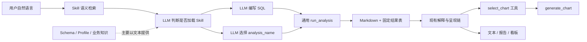
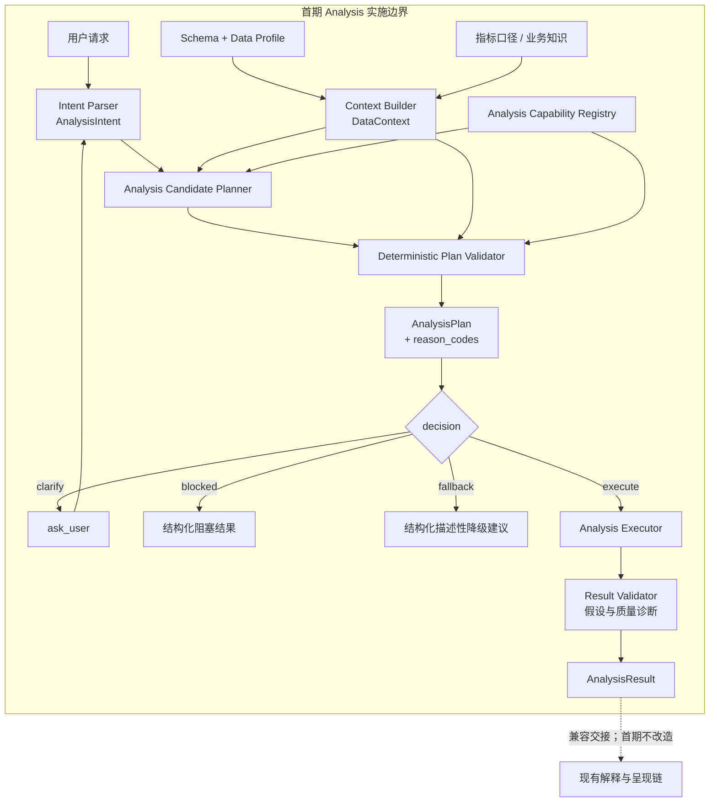

# 分析决策规划架构 RFC

> 状态：**已按维护者意见修订，等待重新审查；未开始实现**
> 原始提案日期：2026-08-23
> 本次修订日期：2026-08-25
> 首期范围：Analysis 侧结构化契约、能力元数据、候选规划、确定性验证、统一决策、结果契约与本地离线评测
> 兼容原则：保留现有 Skill、`run_analysis` 和分析完成后的呈现链，渐进迁移并允许回退

## 0. 本次修订与希望维护者确认的事项

维护者已经认可以下方向：

- 使用统一 `AnalysisPlan` 与能力注册表承载分析决策；
- LLM 负责语义理解，确定性代码负责机器可验证约束；
- 先做本地离线影子评测，不先合并运行时影子路径。

本次修订逐项处理命名、Skill 硬约束迁移、评测集抽审、稳定 `reason_codes` 和首期范围五项意见。
本 RFC PR 仍然只包含文档，不包含生产代码、评测数据或模型调用结果。希望维护者重新审查并确认：

1. 是否认可第 7 节的 `analysis-reason-codes/v1` 初版枚举与兼容规则；
2. 冻结评测集采用“维护者分层抽审”还是“维护者隐藏/保留案例”；
3. 是否接受第 9.4 节的建议门槛，并允许在本地开始首期 Analysis 侧实现与评测。

在 PR 合并或维护者明确允许继续前，不开始生产代码改造。

## 1. 背景

项目已经具备较完整的数据分析执行能力：

- `agent/skill_discovery.py` 使用语义向量、词法和名称信号检索相关 Skill；
- `skills/*/SKILL.md` 提供回归、聚类、时序预测等分析 SOP；
- `Function/Analyze/registry.py` 注册分析实现并由 `run_analysis` 执行；
- `profile_data`、`get_schema` 和知识库为模型提供数据与业务上下文；
- `select_chart`、`generate_chart`、报告和看板工具构成现有下游呈现链。

当前主要缺口不是分析算法数量，而是分析决策分散在 Skill 检索、系统 Prompt、命令提示、
LLM 自由判断、分析注册表和各分析模块中。系统可以执行某种方法，但缺少统一对象说明：

- 为什么选择这个方法；
- 当前数据是否满足字段、样本量、质量和方法假设；
- 参数是否合法，哪些诊断必须执行；
- 为什么执行、澄清、阻塞或降级；
- 执行后产生了哪些结果表、指标、诊断、警告和证据。

## 2. 当前调用链与问题



### 2.1 Skill 检索不是方法适用性验证

Skill 检索能找到语义相关的方法，但没有统一结合目标变量类型、样本量、时间频率、类别平衡、
缺失率、用户目标和方法假设，确定候选方法是否真正可用。

### 2.2 分析注册表只描述“怎么运行”

现有分析注册表主要包含 ID、描述、参数名、输出表和执行函数，尚未统一声明：

- 支持的分析目标；
- 输入字段角色与类型；
- 最低数据量和质量要求；
- 参数 Schema、依赖、前置条件和禁用条件；
- 必需诊断和结构化输出契约。

### 2.3 数据画像没有成为稳定的机器决策输入

数据概况已经能够计算字段类型、缺失和分布，但这些结果主要作为 Markdown 交给 LLM，尚未形成
供 Planner 和 Validator 稳定消费的 `DataContext`。

### 2.4 通用参数接口承载了不同含义

`run_analysis` 用 `target_column`、`groupby_column`、`n_deciles` 驱动多种分析。不同方法可能
复用同一个参数表达目标字段、分组字段、分桶数量或聚类数量，导致参数难以类型化验证，也增加
模型调用错误的风险。

### 2.5 缺少统一分析结果契约

分析模块目前可能返回 Markdown、三元组、四元组或命名字典。缺少统一 `AnalysisResult` 时，核心
指标、诊断、警告、假设状态、来源和执行参数无法被稳定记录和测试。

### 2.6 分析决策和澄清策略不统一

Skill 检索、LLM 判断和分析模块分别拥有不同规则。第一、第二候选接近、缺少必要字段、样本不足、
数据质量阻塞或方法假设失败时，尚无统一的 `execute/clarify/blocked/fallback` 决策。

### 2.7 硬约束分散导致维护漂移

同一方法的字段类型、最小样本量、参数范围和禁用条件可能同时存在于系统 Prompt、Skill、分析
注册表和模块实现中。新增或修改方法时需要人工保持多处一致，容易形成新的漂移点。

### 2.8 图表相关命名边界

当前代码中的两个名称承担不同职责，不能机械统一成同一个名称：

- `select_chart`：`agent/tools/schemas.py` 暴露给 Agent 的对外工具名，使用单数；
- `select_charts(...)`：`LLM/chart_selector.py` 内部返回多个候选的 Python 函数，使用复数；
- `_tool_select_chart(...)`：现有工具适配层，调用内部 `select_charts(...)`。

首期不修改这三个名称、调用关系或图表选择行为。

## 3. 首期目标与非目标

### 3.1 目标

1. 用统一 `AnalysisPlan` 记录一次分析的目标、数据、候选、方法、参数、验证和预期输出；
2. 让 LLM 负责语义理解和有限候选生成，让确定性代码负责字段、数据和方法硬约束；
3. 在执行前发现不适用方法、字段错误、参数冲突、样本不足和证据不足；
4. 用统一置信度、候选分差和稳定 `reason_codes` 产生四种决策；
5. 用 `AnalysisResult` 统一结果表、指标、诊断、警告、假设状态、来源和执行参数；
6. 保持现有公开入口、Skill 和执行结果兼容，并提供明确回退路径；
7. 在生产代码 PR 前提供可复现、经维护者抽审的本地离线对照结果。

### 3.2 非目标与后续范围

以下内容不属于首期实现、文件修改或评测指标，后续如需推进应使用独立 RFC/PR：

- Presentation Planner；
- Visualization Capability Registry 或现有图表注册表重构；
- `select_chart`、`select_charts(...)` 或 `LLM/chart_selector.py` 再次重构；
- 文本、表格、图表、报告或看板的呈现决策改造；
- AutoML、自动超参数搜索或因果推断平台；
- 一次性重写现有分析算法或输出工具。

首期架构主链终止于 `AnalysisResult`，表示本阶段不改造下游呈现架构，并不取消呈现功能。
`AnalysisResult` 产生后必须通过兼容适配继续进入当前呈现链；现有图表、报告和看板行为保持原样。

本地离线影子只运行冻结案例，不进入真实用户请求。上游不长期维护双 Planner，也不接收仅用于
运行时影子的独立 Planner PR。

## 4. 首期 Analysis 目标架构



主链和职责边界如下：

- **LLM**：理解用户语义、补全业务目标、生成有限候选，不声明数据硬约束已经满足；
- **Analysis Candidate Planner**：归一化候选、应用显式方法优先级并计算可比较分数；
- **确定性 Plan Validator**：验证字段、类型、样本、质量、参数、依赖、方法假设和候选分差；
- **执行层**：只执行已经验证的计划，不重新解释用户意图；
- **Result Validator**：记录执行后诊断、警告和假设状态，不选择呈现形式；
- **现有呈现链**：通过兼容输出继续工作，不属于首期架构改造范围。

## 5. 核心数据契约

所有契约都带独立 `schema_version`，采用可序列化、可测试的 JSON 兼容字段；动态解释文本与稳定
机器码分离。

### 5.1 AnalysisIntent

```text
schema_version
goal                 describe | compare | diagnose | relate
                     classify | predict | cluster
question
target
features[]
dimensions[]
time_column / id_columns[]
time_scope / forecast_horizon
requested_method
constraints
ambiguities[]
language             zh | en | mixed
```

`requested_method` 表示用户明确指定的方法，但不能绕过 Validator。`ambiguities` 只记录会实质改变
方法或字段角色的问题，避免对不影响决策的细节过度澄清。

### 5.2 DataContext

```text
schema_version
table / source
row_count
columns[]
  - name
  - physical_type
  - semantic_roles[]
  - nullable / missing_rate
  - cardinality
  - numeric_range / allows_negative
  - class_distribution
  - time_frequency / continuity
grain
metric_contracts
quality_warnings[]
```

`profile_data` 可继续输出人类可读 Markdown，同时提供或派生稳定 JSON 结构供 Planner 使用。
语义角色推断必须保留证据和置信度；不能只根据列名把 ID 当作连续数值特征。

### 5.3 AnalysisCapability

每个分析方法在注册表中声明：

```text
schema_version
method_id
supported_goals[]
selection_mode        automatic | explicit_only
input_roles_and_types
minimum_data_requirements
data_quality_requirements
preconditions
incompatibilities
parameter_schema
runtime_dependencies[]
required_diagnostics[]
output_contract
```

字段角色、类型、样本量、参数 Schema、依赖、前置条件、禁用条件和输出契约都是机器可验证硬约束。
约束使用稳定 `constraint_id + args` 表达，不允许在元数据中保存不可序列化 Lambda。通用模型或
神经网络入口可以标记为 `explicit_only`，避免首期演变为 AutoML。

### 5.4 AnalysisCandidate

```text
schema_version
method_id
semantic_score
field_roles
parameters
proposal_source       explicit_user | llm | legacy_adapter
```

LLM 只提交有限候选及语义证据。旧 `run_analysis` 调用可被兼容适配为一个 `legacy_adapter` 候选，
但仍必须经过相同 Validator。

### 5.5 AnalysisPlan

```text
schema_version
reason_code_version
decision              execute | clarify | blocked | fallback
intent
data_context_ref
method_id
field_roles
parameters
prechecks[]
expected_outputs[]
confidence
runner_up_margin
reason_codes[]
validation_errors[]
candidate_summary[]
```

每个 `validation_errors[]` 元素至少包含 `constraint_id`、相关字段或角色、`expected`、`actual` 和
人类可读 `message`；动态值只进入这里，不进入稳定 `reason_codes` 枚举。

### 5.6 AnalysisResult

```text
schema_version
reason_code_version
plan_ref / method_id
result_tables[]
metrics
diagnostics
warnings[]
assumption_status[]
data_provenance
execution_parameters
compatibility_markdown
```

`AnalysisResult` 是首期架构终点，但不是用户交互终点。执行适配器将其投影为现有 Markdown 和结果
表契约，随后继续调用现有呈现链；首期不在 `AnalysisResult` 中新增图表或报告选择。

## 6. 候选、验证与统一决策

### 6.1 候选排序

候选方法使用以下信息排序：

1. 用户目标和问题类型匹配度；
2. 用户是否明确指定方法；
3. 字段角色和语义适配度；
4. 用户对准确性、速度和可解释性的约束；
5. 第一候选与第二候选的分差。

样本量、字段类型、数据质量、参数范围、依赖和方法假设不作为可以被高语义分数抵消的软分数，
而由 Validator 作为硬约束处理。

### 6.2 决策规则

Planning Service 只能输出以下四种决策：

- **execute**：候选通过全部硬约束，且满足语义置信度和候选分差软门槛；用户明确指定且合法的
  方法不受语义置信度或候选分差软门槛影响；
- **clarify**：语义歧义会改变方法或字段角色；或者用户未明确指定合法方法时，最高合法候选的
  语义置信度低于门槛，或第一、第二合法候选分差低于门槛；
- **blocked**：缺少必要字段、数据不满足任何方法的硬约束，或没有可安全执行的候选；
- **fallback**：高级方法不合法，但仍存在经过验证的描述性分析；不能静默改选另一个高级方法。

建议初始语义置信度门槛为 `0.70`，合法候选的 runner-up margin 门槛为 `0.15`；它们是待维护者
确认并由冻结评测校准的软门槛。硬约束不因阈值调低而放宽。

`clarify`、`blocked` 和 `fallback` 都是可测试的正常决策，不应伪装成工具异常。只有 `execute`
进入对应分析实现；未执行决策不得写分析结果表。

## 7. 稳定 reason_codes v1

首期版本标识为 `analysis-reason-codes/v1`。以下枚举覆盖候选依据、验证通过、澄清、阻塞和降级：

| 类别 | reason code | 稳定语义 |
|---|---|---|
| 目标与偏好 | `analysis_goal_matched` | 候选支持结构化分析目标 |
| 目标与偏好 | `analysis_user_method_requested` | 用户明确指定该方法；仍需通过硬约束 |
| 验证通过 | `analysis_field_roles_compatible` | 必要字段角色与类型兼容 |
| 验证通过 | `analysis_sample_size_sufficient` | 样本量满足方法下限 |
| 验证通过 | `analysis_data_quality_passed` | 缺失、类别分布或时间连续性等质量门禁通过 |
| 验证通过 | `analysis_assumptions_satisfied` | 可在执行前验证的方法假设成立 |
| 澄清 | `analysis_intent_ambiguous` | 存在会改变方法或字段角色的语义歧义 |
| 澄清 | `analysis_semantic_confidence_too_low` | 非显式候选的语义置信度低于软门槛 |
| 澄清 | `analysis_candidate_margin_too_low` | 第一、第二合法候选分差低于门槛 |
| 阻塞 | `analysis_required_field_missing` | 缺少方法所需字段角色 |
| 阻塞 | `analysis_target_type_incompatible` | 目标字段类型与方法不兼容 |
| 阻塞 | `analysis_sample_size_insufficient` | 总体、分组或类别样本量不足 |
| 阻塞 | `analysis_data_quality_blocked` | 缺失、失衡或时间连续性等质量问题阻止执行 |
| 阻塞 | `analysis_assumption_violated` | 已验证的方法假设不成立 |
| 阻塞 | `analysis_parameter_invalid` | 参数缺失、类型错误、冲突或超出允许范围 |
| 阻塞 | `analysis_dependency_unavailable` | 必需运行时依赖不可用 |
| 阻塞 | `analysis_no_valid_candidate` | 所有候选均被过滤且无可执行方法 |
| 降级 | `analysis_descriptive_fallback_selected` | 已选择经过验证的描述性降级方案 |

兼容与测试规则：

- v1 中已发布的值不得重命名、删除或改变语义；同一 major 下只能追加；
- 破坏性变化发布新 major，例如 `analysis-reason-codes/v2`，并至少保留一个发布周期的旧值映射；
- 读取端保留未知 code，不能因出现新 code 丢弃整个计划或结果；
- `reason_codes` 按本节枚举顺序输出并去重，每个决策至少包含一个能够解释该决策的 code；
- 动态字段名、阈值、实际值和自然语言消息进入 `validation_errors`，不生成临时 reason code；
- `AnalysisPlan`、`AnalysisResult` 和评测记录显式携带 `reason_code_version`。

## 8. Skill 硬约束迁移与兼容策略

### 8.1 规则所有权

| 位置 | 保留内容 | 不得承担的内容 |
|---|---|---|
| Capability Registry | 类型、样本量、参数、依赖、前置/禁用条件、输出契约 | 业务沟通与解释文案 |
| Skill | 业务 SOP、指标口径确认、泄漏提醒、解释要求、用户沟通、方法使用建议 | 覆盖、放宽或另行定义 Registry 硬约束 |
| Prompt / 命令提示 | 引导工具调用和收集结构化意图 | 复制数值阈值、参数枚举或指示绕过 Validator |
| 分析模块 | 与 Registry 一致的防御性输入检查 | 成为调用前适用性判断的另一真相源 |

当 Skill、Prompt、旧调用参数或 LLM 候选与 Registry 冲突时，Registry 和 Validator 始终优先。
用户/工作区 Skill 覆盖同名内置 Skill 时也不能改变这一优先级。

### 8.2 迁移步骤与去重

1. **盘点**：为每个内置 Analysis Skill 建立 `method_id` 映射，列出 Skill、Prompt、Registry 和
   分析模块中的现有硬约束及来源；
2. **双轨校验**：先把约束结构化迁入 Capability，保留模块防御性检查；使用边界与无效 fixture
   验证 Registry 拒绝条件和模块实际行为一致；
3. **禁止放宽**：所有执行入口在 Skill 或 Prompt 逻辑之外统一调用 Validator；契约测试证明激活
   任意内置、用户或工作区 Skill 都不能绕过硬约束；
4. **删除重复**：Capability 成为硬约束真相源后，删除 Skill 和 Prompt 中重复的字段类型、数值
   阈值、参数枚举和“即使无效也强制执行”等规则；Skill 改为引用 `method_id`；
5. **持续检测**：CI 校验 Skill 引用的方法存在，禁止 Skill frontmatter 声明机器硬约束字段，并以
   每个 capability 的无效样本回归测试检测 Registry、执行入口与模块防御检查的漂移。

迁移期间的约束盘点随代码 PR 提交；完成后不保留第二套可修改的 Skill 硬约束副本。

### 8.3 保持现有入口和行为

- `run_analysis(...)` 工具名和现有必填参数保持兼容，内部逐步执行经过验证的计划；
- `select_chart` 对外工具、`select_charts(...)` 内部函数和 `_tool_select_chart(...)` 适配层均保持不变；
- `generate_chart(...)`、报告、看板和现有分析后呈现链不在首期改造；
- 兼容范围覆盖 `commands/` 当前实际注册的斜杠命令、用户/工作区 prompt command 和 Analysis Skill，
  不把已经没有注册的遗留分析命令当作现状；
- 旧分析模块的三元组、四元组和命名字典返回值由 `AnalysisResult` 适配器归一化；
- 同步与后台 Job 路径共享同一 Validator，并完整传递 `analysis_options`。

### 8.4 回退

候选实现提供 `validated` 与 `legacy` 模式开关，但不提供 `shadow` 运行时模式。生产代码 PR 达标后
默认使用 `validated`；如出现回归，可切回 `legacy` 并重启。两种模式均继续进入同一现有呈现链。
首期无数据库迁移、无真实流量影子、无双写，回退不删除用户数据。

## 9. 本地离线影子评测

### 9.1 执行原则与审批顺序

PR 合并或维护者明确批准后，贡献者才从届时最新 `upstream/main` 创建独立本地实现 worktree 与
分支。先冻结案例并测量旧路径基线，再实现候选 Planning Service。新旧逻辑只对相同 fixture 或
临时数据源离线运行，不处理真实用户请求，不写真实业务数据。

纯 Planner/Validator 达到决策门槛后，才在本地接入 `run_analysis` 做完整兼容评测。全部门槛达到
后才提交生产代码 PR；未达到就继续本地修订或停止，不提交不成熟实现。

### 9.2 冻结评测集与维护者抽审

公开评测集使用匿名、合成或公开可分享案例，不少于 100 例，建议 112 例，即七种目标各 16 例。
至少覆盖：

- describe、compare、diagnose、relate、classify、predict 和 cluster；
- 数值、类别、时间和 ID 字段及其组合；
- 目标类型错误、样本不足、严重缺失、类别失衡和时间不连续；
- 应澄清和不应澄清的案例；
- 中文、英文和中英混合表达；
- `commands/` 中当前注册的斜杠命令、用户/工作区 prompt command 和 Analysis Skill 兼容场景。

评测集使用 canonical JSONL，manifest 记录版本、SHA-256、冻结时间、覆盖统计、标签规范和审核方式。
冻结后修改任何输入或期望值都必须发布新版本和 hash，并重新运行 baseline 与 candidate。

冻结前采用以下任一治理方式：

1. 维护者按目标、语言和失败类型分层抽审至少 20%，且不少于 20 例；或
2. 维护者提供不少于 20 个隐藏/保留案例，由维护者运行或只向贡献者返回汇总结果。

贡献者不能根据隐藏案例逐条硬编码。生产代码 PR 附评测摘要，但不泄漏隐藏数据、提示或可逆推出
案例内容的信息。如果维护者暂时无法提供案例，贡献者必须先请求其确认采用哪种抽审方式，不能
自行假定评测集已经通过独立审题。

### 9.3 对照记录

每次运行对每个案例至少记录：

```text
case_id
evaluation_version / evaluation_hash
baseline_commit / candidate_commit
model_provider / model / temperature / repetitions
analysis_intent / data_context
baseline_decision / candidate_decision
expected_method / expected_decision
confidence / runner_up_margin
reason_code_version / reason_codes
validation_errors
latency / model_calls
pass_or_fail / failure_class / reviewer_note
```

失败分类固定为：`intent_parsing`、`data_context`、`capability_metadata`、`candidate_scoring`、
`validation`、`execution_contract` 和 `compatibility`。若模型不能使用确定性参数，每例重复运行三次
并记录决策一致率。

### 9.4 建议门槛

以下门槛只作为 RFC 建议，必须由维护者确认；没有基线时不得伪造提升结果：

- `(decision, method)` 联合准确率比基线提高至少 10 个百分点；
- 非法执行率比基线下降至少 50%，且不高于 5%；维护者保留集不得出现高严重度非法执行；
- 应澄清案例召回率不低于 90%；
- 不应澄清误报率相对基线恶化不超过 5 个百分点；
- 主要目标和语言切片不得下降超过 5 个百分点；
- Skill、当前命令、工具 Schema、同步/Job 执行、输出表和现有呈现链兼容用例 100% 通过；
- 平均模型调用数不超过基线 `+0.25`，P95 延迟不超过基线 `+20%`；
- 需要重复运行时，候选决策一致率至少 95%。

评测报告展示绝对数量、比例、切片和失败分类，不只报告总分。

### 9.5 提交流程与审批门

```text
修订 RFC PR（当前）
    ↓ 维护者合并，或明确批准实现、抽审方式和门槛
本地冻结评测集并测量旧路径基线
    ↓ 抽审方式、版本/hash 与基线记录完整
本地实现纯 Analysis Planner / Validator
    ↓ 决策门槛达到
本地接入 run_analysis 并完成执行、兼容和回退评测
    ↓ 全部门槛达到且独立审查通过
提交一个 Analysis 侧生产代码 PR并附评测摘要
```

代码 PR 不包含运行时影子路径。提交前向维护者说明 baseline/candidate SHA、评测 hash、绝对数量、
比例、失败分类、延迟、模型调用、兼容性和回退方案。

## 10. 首期测试与验收范围

- **单元测试**：契约序列化、`DataContext` 类型与角色推断、reason code 顺序和去重、候选排序、
  每种硬约束及四种决策；
- **能力契约测试**：当前注册的全部分析方法都有合法 capability，方法 ID、参数 Schema、依赖和
  输出契约与旧注册信息一致；
- **Skill 一致性测试**：Skill 引用的方法存在，不能声明或放宽硬约束，无效 fixture 始终被
  Validator 拒绝；
- **执行集成测试**：只有合法 `execute` 计划进入分析器；其他决策不写表；同步/Job 路径一致，
  `analysis_options` 不丢失，现有返回形状均可归一化；
- **兼容回归测试**：现有 `run_analysis` Schema、结果表、工具暴露、workflow stage 和分析后的
  呈现链不变；现有 chart selector 测试继续通过，首期 diff 不包含 chart selector 或 Presentation 改造；
- **评测协议测试**：manifest/hash 可复现，必填记录齐全，未知 reason code 可向前兼容；
- **独立审查**：非实现者复核 RFC 对齐、执行门禁、数据泄漏、评测可复现性和回退路径；未解决的
  高或中优先级问题阻止生产代码 PR。

## 11. 成本与风险

| 风险 | 影响 | 缓解方式 |
|---|---|---|
| 能力元数据维护成本 | 新方法需要声明更多契约 | 提供 Schema 校验、注册模板和行为一致性测试 |
| Planner 增加延迟 | 结构化规划可能增加耗时 | 优先在同一次模型调用中生成意图和候选；确定性过滤不调用模型 |
| 离线案例代表性不足 | 本地结果可能高估真实效果 | 冻结 hash、覆盖失败切片并由维护者抽审或提供保留集 |
| 规则过严 | 合法分析被阻止 | 提供 clarify、fallback、稳定 reason code 和可校准软门槛 |
| Skill 与 Registry 再次重复 | 形成新的漂移点 | Registry 作为唯一硬约束源，禁止 Skill 放宽并持续运行一致性测试 |
| 旧返回形状不一致 | 合法模块无法进入统一结果契约 | 在执行适配器归一化并覆盖三元组、四元组和命名字典测试 |
| 首期范围再次扩大 | 叠加 chart_selector 或呈现回归 | 首期主链止于 AnalysisResult；呈现架构使用独立 RFC/PR |

## 12. 后续代码范围草案（本 PR 不实施）

首期生产代码 PR 预计只涉及 Analysis 侧边界：

```text
agent/planning/models.py          AnalysisIntent / DataContext / AnalysisPlan / AnalysisResult
agent/planning/context.py         schema/profile/knowledge 结构化上下文
agent/planning/candidates.py      候选分析方法归一化与排序
agent/planning/validator.py       方法、字段、样本、质量、参数和依赖验证
agent/planning/service.py         execute / clarify / blocked / fallback 统一决策
agent/planning/executor.py        已验证计划执行与 AnalysisResult 兼容适配
Function/Analyze/registry.py      扩展 AnalysisCapability 元数据
agent/tools/business/data.py      在现有 run_analysis 路径接入验证与结果适配
evaluation/analysis_planning/     冻结协议、案例、runner 与评测摘要
tests/test_analysis_*.py          单元、契约、集成、兼容和评测协议测试
```

`agent/prompts.py`、Skill 解析代码或 Analysis `SKILL.md` 只在迁移重复硬约束所必需时调整。
`agent/workflow_stage.py` 原则上不修改，以回归测试证明路由不变。

Presentation Planner、Visualization Registry、`LLM/chart_selector.py`、报告和看板呈现决策明确留给
后续独立 RFC/PR。首期 `AnalysisResult` 仍通过兼容适配进入这些现有流程。

## 13. 请求重新审查

请维护者重点确认：

- 第 2.8 节对 `select_chart`、`select_charts(...)` 和 `_tool_select_chart(...)` 的命名边界；
- 第 8 节的 Skill 硬约束迁移、去重和唯一真相源规则；
- 第 9.2 节采用维护者抽审还是隐藏/保留案例；
- 第 7 节的 `reason_codes` v1 与第 9.4 节建议门槛；
- 第 3、4、12 节的 Analysis 首期范围与 Presentation 后续拆分。

收到合并或明确实施许可前，不修改生产行为。
