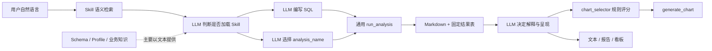
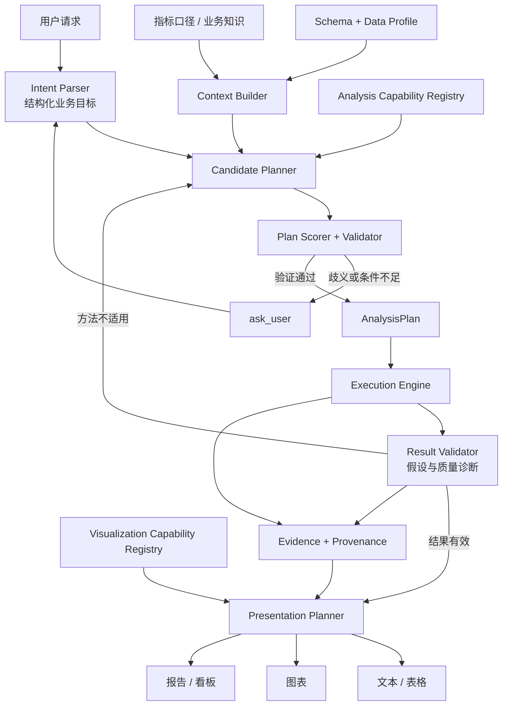

# 分析决策与呈现规划架构 RFC

> 状态：**提案，等待维护者反馈；未开始实现**
> 日期：2026-08-23
> 范围：分析方法选择、数据适用性验证、置信度与澄清、分析结果契约、呈现形式规划
> 兼容原则：保留现有 Skill、`run_analysis`、`select_chart` 和 `generate_chart` 公共入口，渐进迁移

## 0. 希望维护者确认的事项

这份 RFC 只描述方向和验证方式，不修改生产代码。希望维护者确认：

1. 是否认可引入统一、结构化的 `AnalysisPlan` 作为分析决策真相源？
2. 是否接受“先在贡献者本地离线影子评测并记录结果，达到门槛后再提交代码 PR”的方式？
   本提案不计划提交一个仅用于运行时影子 Planner 的独立 PR。
3. 如果方向可行，后续代码更适合一个完整 PR，还是按数据契约、能力注册表、Planner、
   Presentation Planner 拆成多个可独立审查的 PR？

在维护者确认方向前，不开始生产代码改造。

## 1. 背景

项目已经具备较完整的数据分析执行能力：

- `agent/skill_discovery.py` 使用语义向量、词法和名称信号检索相关 Skill。
- `skills/*/SKILL.md` 提供回归、聚类、时序预测等分析 SOP。
- `Function/Analyze/registry.py` 注册分析实现并由 `run_analysis` 执行。
- `LLM/chart_selector.py` 根据意图和字段名推荐图表。
- `profile_data`、`get_schema` 和知识库为模型提供数据与业务上下文。
- 报告、看板和导出工具已有 proposal/confirm 人工确认流程。

当前主要缺口不是分析算法数量，而是分析决策分散在 Skill 检索、系统 Prompt、斜杠命令、
LLM 自由判断、分析注册表和图表规则中。系统可以执行某种方法，但缺少一个统一对象说明：

- 为什么选择这个方法；
- 当前数据是否满足方法条件；
- 哪些假设需要验证；
- 结果应产生哪些表、指标和诊断；
- 为什么最终选择文本、表格、图表、报告或看板；
- 置信度不足时为什么执行、澄清或停止。

## 2. 当前调用链与问题



### 2.1 Skill 检索不是方法适用性验证

Skill 检索能找到语义上相关的方法，但没有统一结合目标变量类型、样本量、时间频率、类别
平衡、缺失率、泄漏风险、用户目标和可解释性要求，确定候选方法是否真正可用。

### 2.2 分析注册表只描述“怎么运行”

现有分析注册表主要包含 ID、描述、参数名、输出表和执行函数，尚未统一声明：

- 支持的问题类型；
- 输入字段角色与类型；
- 最低数据量和质量要求；
- 前置条件、禁用条件和诊断；
- 成本与可解释性；
- 结构化输出契约和推荐呈现形式。

### 2.3 数据画像没有成为稳定的机器决策输入

数据概况已经能够计算字段类型、缺失和分布，但这些结果主要作为 Markdown 交给 LLM。
`select_charts(user_intent, available_columns, top_n)` 只接收字段名，无法可靠判断字段类型、
基数、时间连续性、正负值、单位、粒度和数据点数量。

### 2.4 通用参数接口承载了不同含义

`run_analysis` 用 `target_column`、`groupby_column`、`n_deciles` 驱动多种分析。不同方法可能
复用同一个参数表达目标字段、算法选项、分桶数量或聚类数量，导致参数难以类型化验证，
也增加模型调用错误的风险。

### 2.5 分析结果与呈现规划断开

分析模块返回 Markdown 和若干结果表，随后 LLM 再次依据上下文决定图表或文档。中间缺少
统一 `AnalysisResult`，无法稳定声明核心指标、诊断、警告、来源、推荐图表和可用证据。

### 2.6 置信度和澄清策略不统一

Skill 检索、图表评分和 LLM 判断分别拥有不同阈值。第一、第二候选接近、数据条件不足、
方法假设失败等情况没有统一的执行/澄清/拒绝策略。

### 2.7 规则分散导致维护漂移

同一方法的工作流和呈现建议可能同时存在于系统 Prompt、斜杠命令、Skill 和注册表中。
新增或修改方法时需要人工保持多处一致，容易出现 Prompt 已更新但运行契约未更新的情况。

## 3. 目标与非目标

### 3.1 目标

1. 用统一 `AnalysisPlan` 记录一次分析的目标、数据、方法、参数、验证、输出和呈现计划。
2. 让 LLM 负责语义理解和候选生成，让确定性代码负责数据兼容、方法条件和安全边界。
3. 在执行前发现不适用方法、字段错误、参数冲突和证据不足。
4. 用统一置信度和候选分差决定执行、澄清或停止。
5. 让呈现方式同时考虑业务问题、数据形状、分析结果和受众，而非只匹配图表关键词。
6. 保持现有公开工具入口兼容，允许渐进迁移和回退。
7. 在代码提交前提供可复现的本地离线对照结果。

### 3.2 非目标

- 本阶段不建设 AutoML 平台或自动超参数搜索系统。
- 不允许 LLM 绕过确定性验证器直接执行不兼容计划。
- 不一次性重写所有分析算法、图表实现和输出工具。
- 不取消现有 Skill；Skill 继续承担方法 SOP 和用户可扩展能力。
- 不在上游生产运行时长期维护双 Planner 或流量影子路径。
- 本 RFC PR 不包含任何生产代码、测试数据或模型调用结果。

## 4. 建议目标架构



核心边界是：

- **LLM**：理解用户语义、补全业务目标、生成有限候选、解释有效结果。
- **确定性 Planner/Validator**：验证字段类型、方法条件、参数、置信度和候选分差。
- **执行层**：只执行已经验证的计划，不负责重新解释用户意图。
- **呈现层**：根据结构化结果选择表现形式，不从原始用户句子重新猜测。

## 5. 核心数据契约

### 5.1 AnalysisIntent

```text
goal                 描述 | 比较 | 诊断 | 解释 | 预测 | 分群
question_type        趋势 | 关系 | 构成 | 分布 | 异常 | 分类 | 预测
target               目标指标或标签
dimensions           分组、对比和切片维度
time_scope           时间范围、频率和预测期
audience             分析师 | 业务负责人 | 管理层
artifact             对话 | 图表 | 报告 | 看板 | 导出
constraints          可解释性、速度、精度和业务限制
ambiguities          尚未确定且可能改变方法的事项
```

### 5.2 DataContext

```text
table / source
row_count
columns[]
  - physical_type
  - semantic_role
  - nullable / missing_rate
  - cardinality
  - numeric_range / allows_negative
  - time_frequency / continuity
grain
metric_contracts
quality_warnings
```

`profile_data` 可继续输出人类可读 Markdown，但同时应提供稳定 JSON 结构供 Planner 使用。

### 5.3 AnalysisCapability

每个分析方法在注册表中声明：

```text
method_id
supported_goals
input_roles_and_types
minimum_data_requirements
preconditions
incompatibilities
parameter_schema
required_diagnostics
output_contract
presentation_hints
cost_and_explainability
```

### 5.4 AnalysisPlan

```text
intent
dataset
method_id
field_roles
parameters
prechecks
expected_outputs
presentation_hints
confidence
runner_up_margin
reason_codes
```

### 5.5 AnalysisResult 与 PresentationPlan

`AnalysisResult` 统一描述结果表、核心指标、诊断、警告、假设状态、数据来源和执行参数。
`PresentationPlan` 再根据问题、受众、结果类型和数据规模选择文本、表格、图表、报告或看板。

## 6. 方法选择与澄清策略

候选方法建议从以下维度评分：

1. 用户目标和问题类型匹配度；
2. 字段角色、数据类型和样本量兼容性；
3. 数据质量和方法假设满足程度；
4. 用户对准确性、速度和可解释性的要求；
5. 计算成本；
6. 用户明确指定的方法偏好；
7. 第一候选与第二候选的分差。

决策输出只能是：

- **execute**：候选通过全部硬约束，置信度及分差达到门槛；
- **clarify**：多个合法候选会产生实质不同结论，或缺少会改变方法的业务信息；
- **blocked**：数据不满足任何方法的必要条件；
- **fallback**：高级方法不适用，但存在经过验证的简单描述性方案。

每次决定都返回稳定 `reason_codes`，便于测试、日志分析和向用户解释。

## 7. 可视化与呈现规划

图表注册表应逐步升级为可视化能力注册表，除图表名称和字段角色外，还声明：

- 支持的分析目标和结果类型；
- 每个 role 的字段类型；
- 类别基数、数据点数量和系列数范围；
- 是否允许负值、是否需要排序或归一化；
- 禁用条件和降级图表；
- 对应的解释模板和无障碍要求。

Presentation Planner 不应把“用户提到关系”直接等价为散点图，而应先判断：

- 是否已有统计分析结果；
- x/y 是否为数值字段；
- 是否需要展示置信区间、残差、预测区间或类别分组；
- 受众需要精确表格、诊断视图还是管理摘要；
- 是否根本不需要图表。

## 8. 兼容与迁移策略

### 8.1 保持现有入口

- `run_analysis(...)` 保留，内部可以逐步转为执行已经验证的计划。
- `select_charts(...)` 保留为兼容适配器；新接口可接收 `DataContext` 和 `AnalysisResult`。
- `generate_chart(...)` 继续负责渲染，但在渲染前增加类型化数据契约校验。
- Skill 继续存在，逐步把重复的硬约束迁移到能力注册表，Skill 保留业务 SOP 和解释要求。
- 斜杠命令继续工作，不要求用户改变已有使用方式。

### 8.2 可回退

新 Planner 需要配置开关。若代码 PR 上线后发现回归，可以切回现有决策路径；执行算法、图表
渲染器和数据源接口不随 Planner 重写，从而缩小回退范围。

## 9. 本地离线影子评测方案

### 9.1 原则

影子 Planner 不作为独立上游 PR，也不进入生产流量路径。维护者认可本 RFC 后，贡献者在本地
分支实现候选 Planner，并让新旧 Planner 对同一批冻结案例独立生成决策，执行结果不展示给
真实用户，也不写入真实业务数据。

只有评测结果达到约定门槛，才提交生产代码 PR。实现 PR 同时附带评测摘要和可复现说明。

### 9.2 冻结评测集

建议至少 100 个匿名、合成或公开可分享案例，覆盖：

- 描述统计、趋势、关系、构成、分布、分类、预测和聚类；
- 数值、类别、时间、地理、ID 和文本字段组合；
- 样本不足、目标类型错误、缺失严重、类别失衡和时间不连续；
- 第一、第二候选接近，需要澄清的歧义场景；
- 中文、英文和中英混合表达；
- 文本、表格、单图、多图、报告和看板呈现目标；
- 现有斜杠命令和 Skill 的关键兼容场景。

案例只保存结构化意图、匿名 schema/profile、预期决策和判定理由，不包含密钥或未经授权的
真实业务数据。

### 9.3 对照记录

每个案例记录：

```text
case_id
baseline_commit / candidate_commit
model_provider / model / temperature
input_intent / data_context
baseline_decision / candidate_decision
expected_method / expected_presentation
confidence / runner_up_margin / reason_codes
validation_errors
latency / model_calls
pass_or_fail / reviewer_note
```

若模型无法设置完全确定性参数，对候选 Planner 重复运行三次并记录一致率。

### 9.4 建议提交门槛

正式阈值由维护者确认。初始建议为：

- 方法选择准确率较基线提升至少 10 个百分点；
- 数据不兼容计划比例下降至少 50%，且不高于 5%；
- 呈现形式适配准确率较基线提升至少 10 个百分点；
- 应澄清案例的召回率不低于 90%；
- 不应澄清案例的误澄清率相对基线恶化不超过 5 个百分点；
- 现有命令、Skill、工具 Schema 和分析执行测试无回归；
- 新增模型调用和 P95 延迟在维护者接受的预算内；
- 所有失败案例均分类为意图解析、数据上下文、能力元数据、评分、验证或呈现问题。

评测报告应同时展示绝对数量、比例和失败案例，不只报告一个总分。

### 9.5 提交流程

```text
RFC 文档 PR（当前）
    ↓ 维护者认可方向和评测门槛
本地建立冻结评测集并测量旧路径基线
    ↓
本地实现候选 Planner 与兼容适配器（不提交影子 PR）
    ↓
本地离线影子对照，记录结果和失败分类
    ↓ 达到门槛
提交生产代码 PR，并附评测摘要、兼容性和回退说明
```

如果未达到门槛，继续在本地修订或停止方案，不把不成熟的 Planner 提交给上游维护。

## 10. 预期收益

### 10.1 分析正确性

方法选择从“语义上像某个 Skill”升级为“目标匹配且数据条件验证通过”，减少分类目标调用线性
回归、短时间序列调用复杂预测模型、类别过多仍使用饼图等错误。

### 10.2 可解释与可审计

`AnalysisPlan` 保存方法、字段、参数、置信度和 `reason_codes`。用户和维护者可以回答“为什么
这样分析”，测试也可以直接断言决策，不再只能检查最终文本。

### 10.3 更一致的澄清体验

所有方法和呈现选择共享执行/澄清/阻塞标准，避免图表会澄清、分析方法却直接猜测的行为差异。

### 10.4 更可靠的呈现

呈现方式由结构化结果驱动，预测可以稳定带预测区间，回归可以带系数和诊断，管理层输出可以
优先结论和风险，而不是仅根据原始用户措辞选一个图表。

### 10.5 更低的长期维护成本

新增分析方法时，开发者在能力注册表中声明输入、条件、输出和呈现提示，减少在 Prompt、Skill、
命令和工具描述之间重复维护规则。

### 10.6 更安全的开源演进

本地离线影子评测把架构重构从“凭感觉提交”变成“先给基线和对照证据”。上游不需要先合并
运行时双路径，也不会让真实用户承担试验风险。

## 11. 成本与风险

| 风险 | 影响 | 缓解方式 |
|---|---|---|
| 能力元数据维护成本 | 新方法需要声明更多契约 | 提供公共默认值、Schema 校验和注册模板 |
| Planner 增加延迟 | 多一次结构化规划或验证 | 优先本地确定性过滤，仅对歧义调用 LLM |
| 离线案例代表性不足 | 本地结果可能高估真实效果 | 覆盖失败场景、语言变化和数据形状；后续只记录匿名反馈指标 |
| 规则过严 | 合法分析被阻止 | 提供 fallback、reason code 和可配置软门槛 |
| 规则与 Skill 再次重复 | 形成新的漂移点 | 能力注册表负责硬约束，Skill 只负责 SOP 和解释 |
| 重构范围过大 | PR 难审查、回归范围大 | 由维护者决定单 PR 或按稳定接口拆分；每步保留适配器 |

## 12. 后续代码范围草案（本 PR 不实施）

可能新增或调整的模块边界：

```text
agent/planning/models.py          AnalysisIntent / DataContext / AnalysisPlan
agent/planning/context.py         schema/profile/knowledge 结构化上下文
agent/planning/candidates.py      候选分析方法生成
agent/planning/policy.py          评分、置信度、分差与澄清策略
agent/planning/validator.py       方法和字段适用性验证
agent/presentation/planner.py     文本、表格、图表和文档规划
Function/Analyze/registry.py      扩展 AnalysisCapability 元数据
LLM/chart_selector.py             保留兼容入口，接入类型化可视化约束
agent/tools/business/data.py      执行已验证计划并返回 AnalysisResult
```

实际文件和 PR 粒度以维护者反馈为准。

## 13. 请求反馈

如果维护者认为问题判断和方向合理，希望确认第 0 节的三个问题，尤其是：

- 是否接受统一 `AnalysisPlan` 和能力注册表作为后续演进方向；
- 是否接受在贡献者本地完成离线影子评测、随代码 PR 提交结果摘要，而不先合并运行时影子路径；
- 希望后续实现以一个完整 PR 还是多个稳定接口 PR 提交。

收到方向确认后，再建立本地评测集和实现计划；在此之前不修改生产行为。
